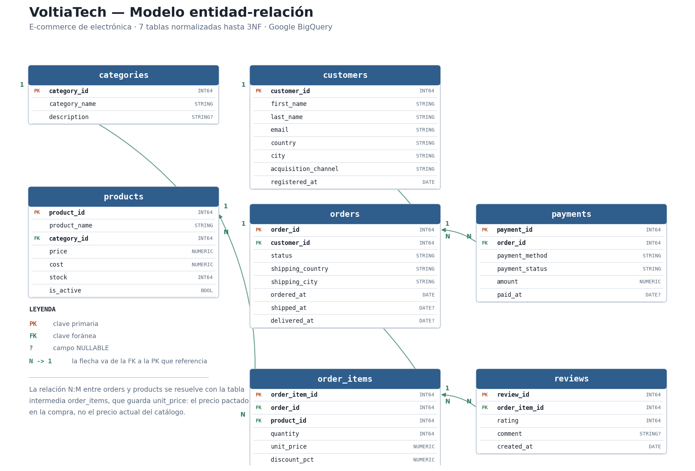

# TC SQL · Parte II — VoltiaTech

Diseño e implementación desde cero de una base de datos relacional para **VoltiaTech**, un
e-commerce de electrónica y accesorios tecnológicos que vende en siete países de Europa.

**Team Challenge del Sprint 6** · Bootcamp Data Science, The Bridge.

---

## Qué hay aquí

| Entregable | Dónde |
|---|---|
| Diagrama entidad-relación | [`docs/er_diagram.png`](docs/er_diagram.png) |
| Justificación de la 3NF | [`docs/normalizacion.md`](docs/normalizacion.md) |
| Creación del dataset y las tablas | [`notebooks/01_setup_bigquery.ipynb`](notebooks/01_setup_bigquery.ipynb) |
| Generación con Faker y carga | [`notebooks/02_generate_data.ipynb`](notebooks/02_generate_data.ipynb) |
| 6 queries analíticas | [`notebooks/03_queries_verification.ipynb`](notebooks/03_queries_verification.ipynb) |

---

## El modelo

**7 tablas normalizadas hasta 3NF.**



| Tabla | Qué guarda |
|---|---|
| `categories` | Clasificación del catálogo |
| `customers` | Clientes: contacto, país, ciudad y canal de captación |
| `products` | Catálogo con precio **y coste** (para poder calcular margen) |
| `orders` | Cabecera del pedido: estado, destino y fechas |
| `order_items` | Detalle de cada pedido — **resuelve la relación N:M** con productos |
| `payments` | Cobros, con su método y su estado |
| `reviews` | Valoraciones, ancladas a **la línea de pedido**, no al pedido |

Las tres decisiones que sostienen el diseño están razonadas en
[`docs/normalizacion.md`](docs/normalizacion.md):

1. **`order_items.unit_price` guarda el precio pagado**, no se lee de `products.price`.
   Si no, cada cambio de tarifa reescribiría la facturación histórica.
2. **`products.cost` junto a `price`.** Sin coste no hay margen, y sin margen no se sabe si
   el producto que más factura es el que más deja. (Spoiler de la query 3: no lo es.)
3. **`reviews` cuelga de `order_items`.** Colgando del pedido constaría que el cliente quedó
   descontento, pero no con qué producto.

---

## Instalación

```bash
git clone https://github.com/RobertTatillo/tc-sql.git
cd tc-sql/parte_002

python -m venv venv
source venv/bin/activate      # Mac/Linux
venv\Scripts\activate         # Windows

pip install -r requirements.txt
cp .env.example .env          # y rellenar los valores
```

### Credenciales de Google Cloud

1. Crear un proyecto en GCP y **activar la API de BigQuery**.
2. IAM & Admin → Service Accounts → crear una cuenta con rol **BigQuery Admin**.
3. Descargar la clave JSON y guardarla en `credentials/` (esa carpeta está en `.gitignore`).
4. Apuntar la ruta en el `.env`:

```
GCP_PROJECT_ID=mi-proyecto-gcp
BQ_DATASET_ID=voltiatech
GOOGLE_APPLICATION_CREDENTIALS=./credentials/service_account.json
```

El `.env` y `credentials/` **nunca** se suben al repositorio.

### Sin credenciales, los notebooks siguen funcionando

El destino de producción es BigQuery, pero exigir credenciales de GCP para abrir el
proyecto significa que quien revise el repositorio —o yo mismo desde otra máquina— no puede
ejecutar absolutamente nada.

Por eso [`src/conexion.py`](src/conexion.py) expone **una sola interfaz sobre dos
implementaciones**: BigQuery y un espejo local de SQLite con **idéntico esquema**, derivado
del mismo `src/esquema.py`. `obtener_backend()` elige solo: si hay credenciales válidas usa
BigQuery, y si no cae al espejo avisando por pantalla.

Las seis queries son SQL estándar y dan el mismo resultado en ambos. La única diferencia que
hubo que salvar es la **aritmética de fechas**, que no está estandarizada: `DATE_DIFF` en
BigQuery, `JULIANDAY` en SQLite.

> Un detalle que juega a favor: **BigQuery no valida las claves foráneas** (las declara como
> informativas), mientras que el espejo local activa `PRAGMA foreign_keys = ON`. Es decir,
> el entorno local es **más estricto** que el de producción: si la carga pasa en local, la
> integridad referencial del modelo está probada.

---

## Cómo ejecutarlo

Los tres notebooks van en orden:

```bash
jupyter notebook notebooks/01_setup_bigquery.ipynb      # crea dataset y tablas
jupyter notebook notebooks/02_generate_data.ipynb       # genera con Faker y carga
jupyter notebook notebooks/03_queries_verification.ipynb  # responde al negocio
```

Para regenerar el diagrama ER tras cambiar el esquema:

```bash
python docs/generar_diagrama.py
```

El diagrama **se dibuja a partir de `src/esquema.py`** en lugar de exportarse de
dbdiagram.io, precisamente para que no pueda quedar desfasado respecto al modelo real.

---

## Datos generados

Todo con `Faker` y semilla fija (42), así que la generación es **reproducible**.

| Tabla | Filas | Mínimo exigido |
|---|---|---|
| `categories` | 8 | — |
| `customers` | 500 | 500 |
| `products` | 70 | 70 |
| `orders` | 2.000 | 2.000 |
| `order_items` | 5.113 | ~4.500 |
| `payments` | 2.000 | uno por pedido |
| `reviews` | 1.149 | ~35% de lo entregado |

**Lo difícil no era el volumen, era la coherencia.** El notebook 02 valida con `assert`
antes de cargar nada:

- **Integridad referencial:** 0 FKs huérfanas en las 6 relaciones.
- **Coherencia temporal:** `entrega >= envío >= pedido >= alta del cliente`. Un cliente no
  puede comprar antes de registrarse, ni recibir algo antes de que salga del almacén.
- **Coherencia de negocio:** ningún producto se vende por debajo de coste, los ratings están
  entre 1 y 5, los descuentos entre 0 y 100, y **solo se valora lo que se ha entregado**
  (valorar un pedido cancelado sería un dato imposible).
- **El importe de cada pago se calcula sumando sus líneas** con el descuento aplicado, no es
  un número al azar. Si no cuadrara, las queries de ingresos se contradirían entre sí.

---

## Las queries

| # | Pregunta de negocio | SQL que ejercita |
|---|---|---|
| 1 | Evolución mensual de ingresos y ticket medio | Agregación temporal |
| 2 | Top 10 de productos por ingresos y margen | `JOIN` de 5 tablas |
| 3 | Rentabilidad por categoría | Agregación + ordenación por margen |
| 4 | Gasto por cliente según país y canal | `GROUP BY` de dos dimensiones + `HAVING` |
| 5 | Tiempo medio de entrega por país | Aritmética de fechas |
| 6 | Productos peor valorados | `JOIN` de 4 tablas + `HAVING COUNT >= 5` |

**Sobre el dinero:** el ingreso de una línea es
`unit_price * quantity * (1 - discount_pct/100)`, y **solo cuenta si el pago está
`completed`**. Un pedido reembolsado o fallido no es ingreso. Esa condición aparece en todas
las queries de facturación, y es exactamente el tipo de matiz que un modelo mal diseñado
haría imposible de expresar.

**Resultado más interesante:** **Laptops** es la categoría que más factura, pero
**Wearables** es la que más margen deja. Sin `products.cost` en el modelo, esa conclusión
—que es la que de verdad interesa a dirección— no se podría calcular.

---

## Estructura

```
parte_002/
├── docs/
│   ├── er_diagram.png          ← diagrama ER
│   ├── generar_diagrama.py     ← lo genera desde src/esquema.py
│   └── normalizacion.md        ← justificación de 1NF, 2NF y 3NF
├── notebooks/
│   ├── 01_setup_bigquery.ipynb
│   ├── 02_generate_data.ipynb
│   └── 03_queries_verification.ipynb
├── src/
│   ├── esquema.py              ← definición única del modelo
│   └── conexion.py             ← backend BigQuery / espejo SQLite
├── data/                       ← el .db local (gitignored)
├── .env.example
├── .gitignore
├── README.md
└── requirements.txt
```

---

## Autoría y flujo de trabajo Git

Proyecto desarrollado **en solitario** por **Robert Matei**
([@RobertTatillo](https://github.com/RobertTatillo)).

Aunque no haya reparto entre personas, el trabajo se organizó igualmente en **feature
branches con Pull Request a `main`**, una por bloque funcional. Trabajando solo esto no
sirve para coordinarse, pero sí para tres cosas que compensan el trámite:

- Cada PR es un **punto de revisión** del propio código antes de integrarlo.
- El historial queda legible: se ve qué entró y por qué, no un único commit gigante.
- `main` se mantiene siempre en un estado ejecutable.

| Rama | Contenido |
|---|---|
| `feature/er-diagram` | `docs/er_diagram.png`, `docs/normalizacion.md`, `src/esquema.py` |
| `feature/bigquery-setup` | `src/conexion.py`, `notebooks/01_setup_bigquery.ipynb` |
| `feature/data-generation` | `notebooks/02_generate_data.ipynb` |
| `feature/queries` | `notebooks/03_queries_verification.ipynb` |

Commits con **Conventional Commits** (`feat:`, `fix:`, `docs:`, `test:`) y merge con
**Squash and merge**.

---

## Stack

Python 3.12 · Google BigQuery · pandas · Faker · python-dotenv · pyarrow · matplotlib
